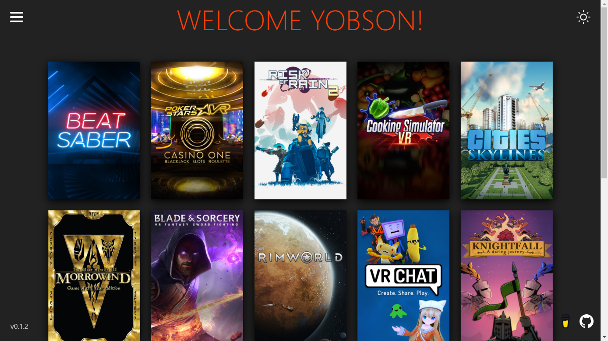
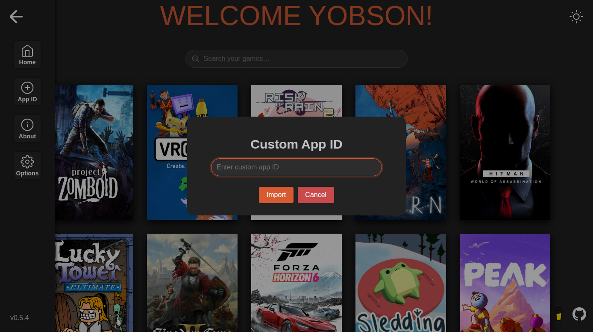
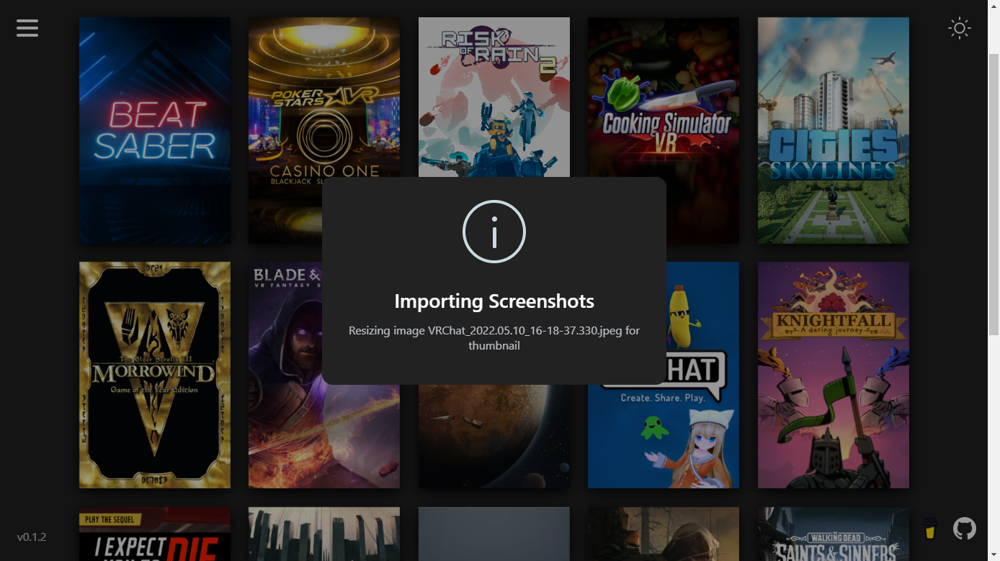
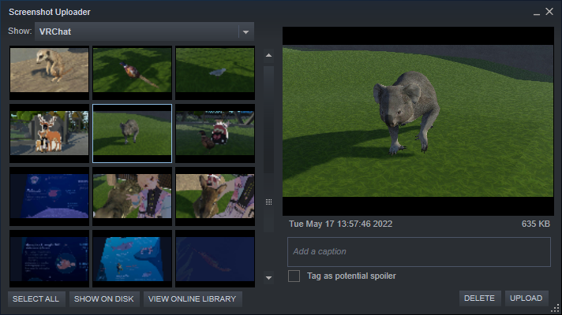
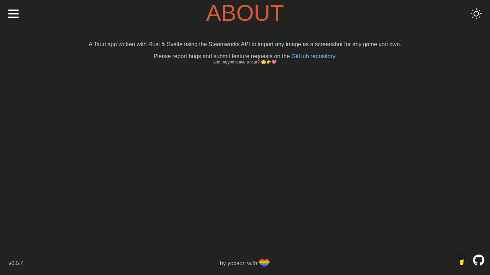
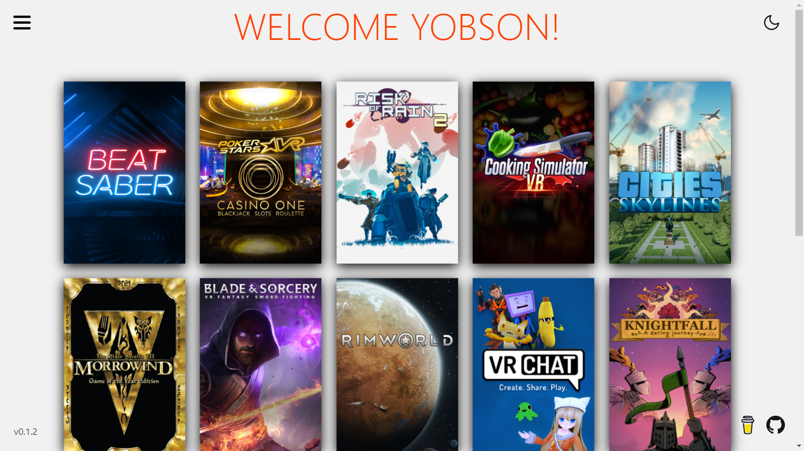

<div align="center">

# Steam Screenshot Importer

[](../../releases/latest)
[](https://aur.archlinux.org/packages/steam-screenshot-importer)

[](/LICENSE)
[](https://tauri.app)
[](https://svelte.dev)

Automatic importing of screenshots into Steam using the Steamworks SDK

</div>

## Usage

### Windows

- Download & run the `msi` installer from the latest [release](../../releases)

### Arch based Linux distros

A built pacman package & AUR package are available for installation.

#### Binary release

- Download the latest `.pkg.tar.zst` file from the [releases](../../releases) page
- Install using `pacman -U <path_to_file>`

#### AUR package

Install using your preferred AUR package manager

```bash
$ paru -S steam-screenshot-importer
```

You can also clone the PKGBUILD from the AUR manually

```bash
$ git clone https://aur.archlinux.org/steam-screenshot-importer.git
$ cd steam-screenshot-importer
$ makepkg -si
```

The same PKGBUILD is also available here in the main repo: [PKGBUILD](/pkg/arch/PKGBUILD)

### Other Linux distros

- Download the latest AppImage from the [releases](../../releases) page
- Make the file executable and run it

```bash
$ chmod +x steam-screenshot-importer-<version>-x86_64.AppImage
$ ./steam-screenshot-importer-<version>-x86_64.AppImage
```

## Supported image formats
Theoretically supports all formats that the [images](https://github.com/image-rs/image#feature-flags) crate supports. They've not all been tested though.

## Platform support

Currently only distributing/testing for Win64 and Arch based Linux distros

## Screenshots











## Light theme


