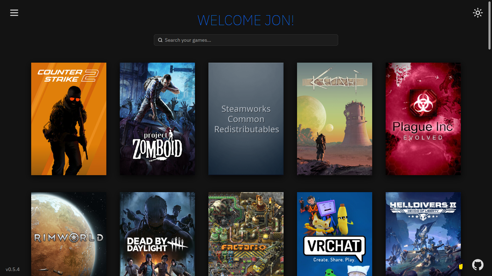
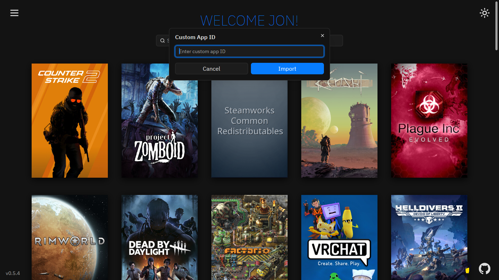
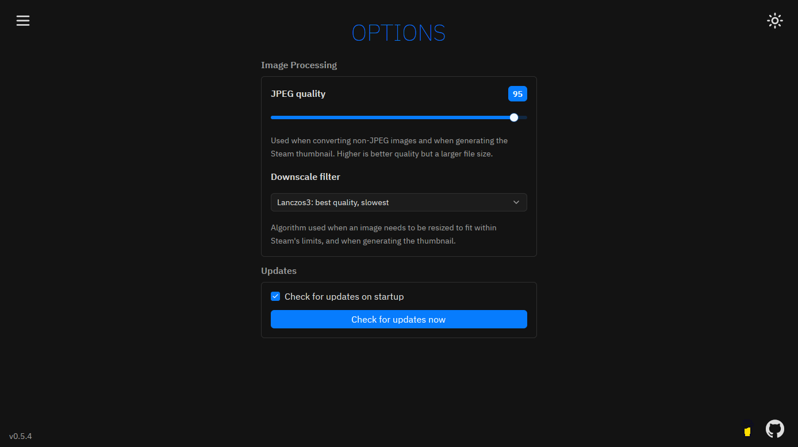
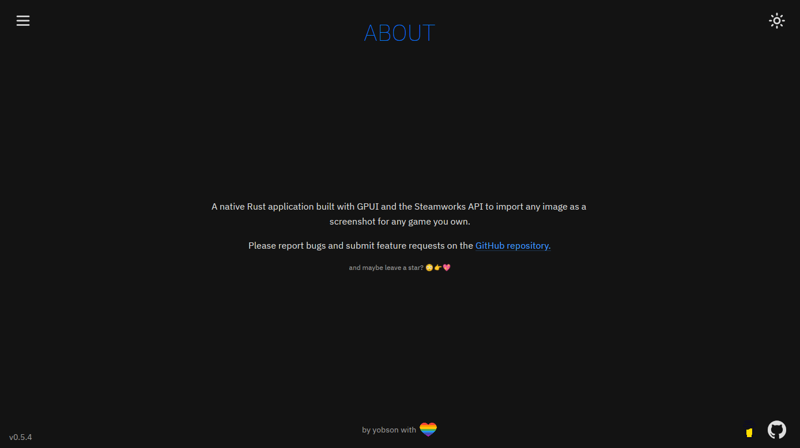
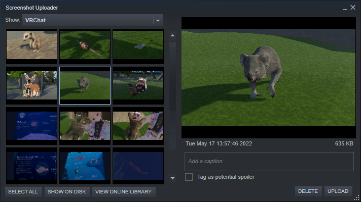
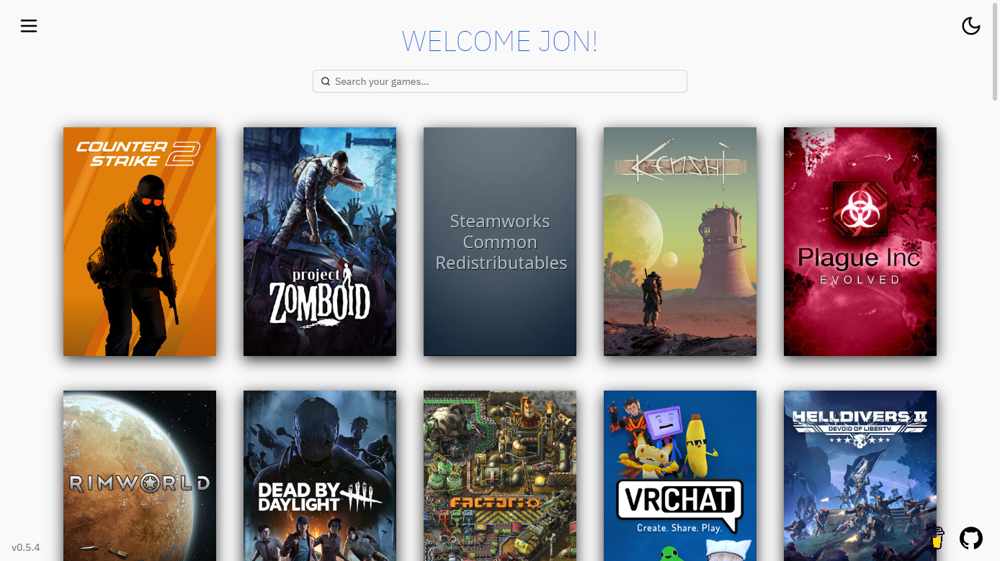

<div align="center">

# Steam Screenshot Importer

[](../../releases/latest)
[](https://aur.archlinux.org/packages/steam-screenshot-importer)

[](/LICENSE)
[](https://www.rust-lang.org/)
[](https://www.gpui.rs/)

Automatic importing of screenshots into Steam using the Steamworks SDK

</div>

## Usage

Steam must be installed and you must be signed into an account that owns the selected game. Start the application, choose a game from your library, then select the images you want to import.

### Windows

- Download the latest Windows `.msi` from the [releases](../../releases) page and run it
- A portable `.zip` is also available; extract it, keep the executable and DLL files together, then run `steam-screenshot-importer.exe`

### Arch based Linux distros

A built pacman package & AUR package are available for installation.

#### Binary release

- Download the latest `.pkg.tar.zst` file from the [releases](../../releases) page
- Install using `pacman -U <path_to_file>`

#### AUR package

Install using your preferred AUR package manager

```bash
$ paru -S steam-screenshot-importer
```

You can also clone the PKGBUILD from the AUR manually

```bash
$ git clone https://aur.archlinux.org/steam-screenshot-importer.git
$ cd steam-screenshot-importer
$ makepkg -si
```

The same PKGBUILD is also available here in the main repo: [PKGBUILD](/pkg/arch/PKGBUILD)

### Other Linux distros

- Download the latest Linux `.tar.gz` from the [releases](../../releases) page
- Extract the archive and run the application

```bash
$ tar -xzf steam-screenshot-importer-<version>-linux-x86_64.tar.gz
$ ./steam-screenshot-importer-<version>-linux-x86_64/steam-screenshot-importer
```

## Features

- Native GPUI interface with light, dark, and system theme modes
- Automatic discovery and search of installed Steam games
- Batch image importing with progress and per-file error reporting
- Configurable JPEG quality and resize filtering
- Automatic and manual update checks

## Supported image formats

Theoretically supports all formats that the [images](https://github.com/image-rs/image#feature-flags) crate supports. They've not all been tested though.

## Platform support

Currently only distributing/testing for Win64 and Arch based Linux distros

## Screenshots











## Light theme


